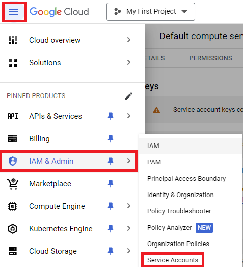
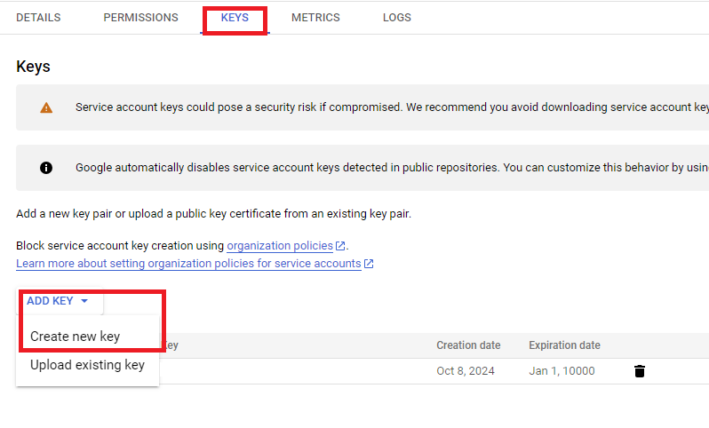
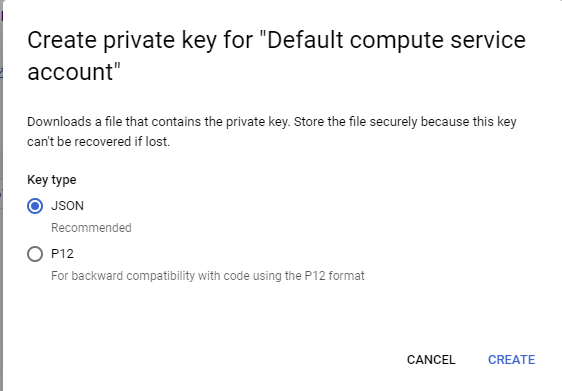

# Documentation du projet Terraform GKE

## 1. Explication des fichiers

### main.tf
Ce fichier est le cœur de la configuration Terraform. Il contient :
- La définition des fournisseurs (Google Cloud et Kubernetes)
- La création d'un cluster GKE
- Le déploiement d'un StatefulSet PostgreSQL
- Le déploiement d'une application FastAPI
- La configuration d'un load balancer Nginx
- La création d'une règle de pare-feu pour autoriser le trafic HTTP/HTTPS

Principaux éléments :
- Un cluster GKE avec un pool de nœuds personnalisé
- Une base de données PostgreSQL déployée en tant que StatefulSet
- Une application FastAPI déployée avec 2 réplicas
- Un load balancer Nginx pour router le trafic vers l'application FastAPI

### terraform.tfvars
Ce fichier contient les variables spécifiques au projet :
- `project_id` : L'ID du projet Google Cloud 
- `region` : La région où déployer les ressources

### variables.tf
Ce fichier définit les variables utilisées dans la configuration :
- `project_id` : L'ID du projet Google Cloud
- `region` : La région par défaut (us-central1, mais surchargée dans terraform.tfvars)
- `gke_num_nodes` : Le nombre de nœuds dans le cluster GKE (par défaut 2)

## 2. Comment lancer les commandes Terraform

Assurez vous d'avoir un environnement avec [Google SDK](https://cloud.google.com/sdk/docs/install-sdk) installé et configuré .

Ensuite, pour déployer cette infrastructure avec Terraform, suivez ces étapes :

1. **Initialisation du projet**
   ```
   terraform init
   ```
   Cette commande initialise le répertoire de travail Terraform, télécharge les plugins nécessaires pour les fournisseurs Google et Kubernetes.

2. **Planification des changements**
   ```
   terraform plan
   ```
   Cette commande crée un plan d'exécution, vous montrant ce que Terraform va faire sans réellement appliquer les changements.

3. **Application des changements**
   ```
   terraform apply
   ```
   Cette commande applique les changements nécessaires pour atteindre l'état désiré de la configuration. Terraform vous demandera de confirmer avant d'appliquer les changements.

4. **Destruction de l'infrastructure (si nécessaire)**
   ```
   terraform destroy
   ```
   Cette commande détruit toutes les ressources créées par Terraform. Utilisez-la avec précaution et seulement quand vous voulez vraiment tout supprimer.

**Note importante** : Assurez-vous d'avoir configuré correctement vos credentials Google Cloud et d'avoir les permissions nécessaires avant d'exécuter ces commandes. Le fichier `credentials.json` mentionné dans `main.tf` doit être présent dans le répertoire de travail.

Pour récupérer ce fichier `credentials.json`, rendez vous sur la console de gcp > IAM & Admin > Service Accounts



Cliquez sur le service account déjà créé.


Ensuite Keys > Add Key > Create new key



Choissisez le JSON et il va vous télécharger le `credentials.json`.



Après un `terraform apply` réussi, vous pourrez accéder à votre application via l'IP du load balancer Nginx, qui sera affichée dans la sortie Terraform.
